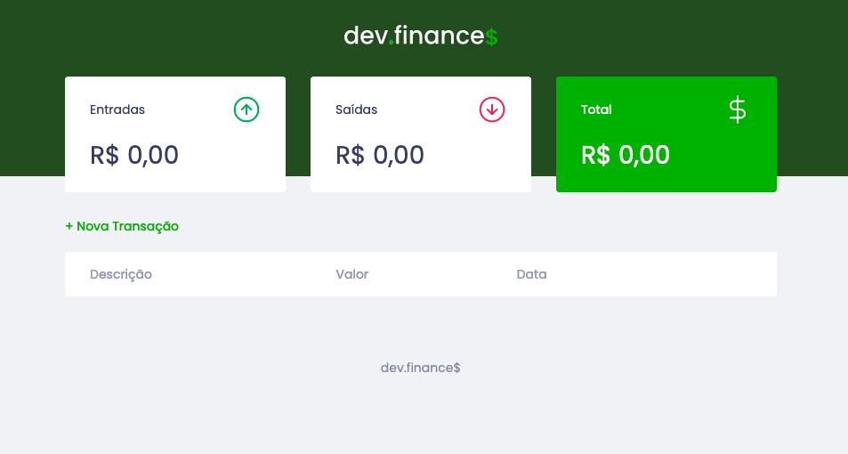
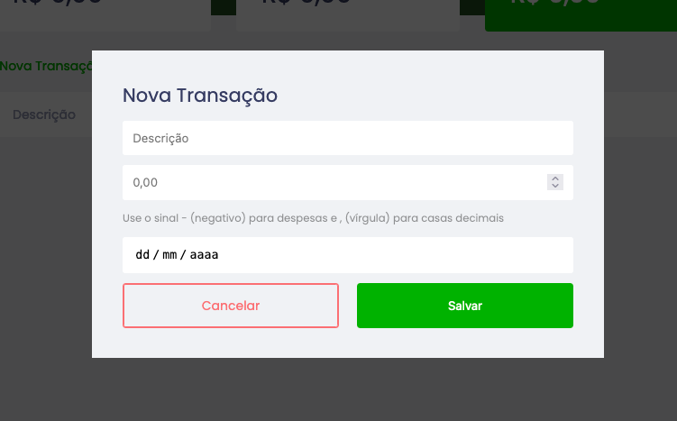
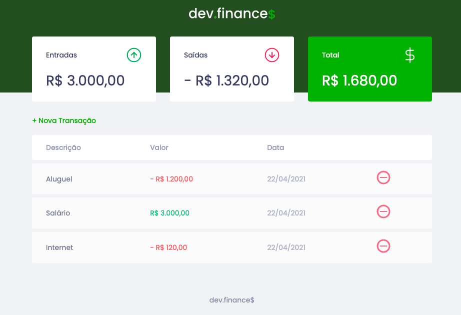

## About this project
The idea of the app is control the monthly finances just putting the incomes and expenses on a form and letting the app do the calculations.
It's a simple but very helpful app.

## Why?
Many times in our lifes we don't have enough patience to sit for a few minutes and fill an excel sheet with all the stuff we want to calculate. It's a boring work to link tables to achive a result.
This app make all this work easy because we just have to fill a form and its done.
 
## Functionalities
* You can create and delete transactions with just one click.
* You can see the total of all incomes and expenses you have and see the total of money you have left.
